# NexusNight - Mail Yönetim Paneli

NexusNight, ASP.NET Core MVC mimarisi kullanılarak geliştirilmiş, kullanıcı yönetimi ve mesajlaşma süreçlerini simüle eden modüler bir mail yönetim paneli uygulamasıdır. Proje, gerçek dünya web uygulamalarında kullanılan kimlik doğrulama, veri yönetimi, kullanıcı etkileşimi ve mesaj işleme akışlarını uçtan uca deneyimlemek amacıyla geliştirilmiştir.

---

## 📌 Proje Amacı
Bu proje, modern web uygulamalarında kullanılan temel backend ve frontend bileşenlerinin birlikte nasıl çalıştığını göstermek, authentication süreçlerini uygulamalı olarak öğrenmek ve veri tabanı ile entegre çalışan sistem mimarisi kurma pratiği kazanmak amacıyla oluşturulmuştur.

---

## 🚀 Özellikler

- Kullanıcı kayıt ve giriş sistemi  
- Email doğrulama mekanizması  
- Mesaj gönderme, alma ve yanıtlama  
- Kategori bazlı mesaj filtreleme  
- Yıldızlı mesaj sistemi  
- Taslak kaydetme özelliği  
- Silme ve geri yükleme işlemleri  
- Profil güncelleme ve fotoğraf yükleme  
- Dashboard istatistik paneli  

---

## 🧠 Sistem Mimarisi

Proje katmanlı mimari yaklaşımıyla geliştirilmiştir:

- **Controller Layer →** İstek yönetimi ve yönlendirme  
- **Service Logic →** İş kuralları ve veri işlemleri  
- **Entity Models →** Veri tabanı tabloları  
- **View Layer →** Razor tabanlı kullanıcı arayüzü  

---

## 🛠 Kullanılan Teknolojiler

- ASP.NET Core MVC  
- Entity Framework Core  
- ASP.NET Identity  
- SQL Server  
- Bootstrap 5  
- Chart.js  
- Razor View Engine  
- LINQ  
- JavaScript  

---

## 📊 Öğrenilen Kazanımlar

Bu proje sayesinde aşağıdaki konularda pratik yapılmıştır:

- Authentication & Authorization sistemi kurma  
- Veritabanı modelleme ve ilişkilendirme  
- CRUD operasyonları yönetimi  
- Gerçek zamanlı kullanıcı akışı tasarlama  
- Katmanlı mimari mantığı  
- UI + Backend entegrasyonu  

---

## 📷 Ekran Görüntüleri

### 🔐 Giriş & Kayıt

### 📝 Kayıt
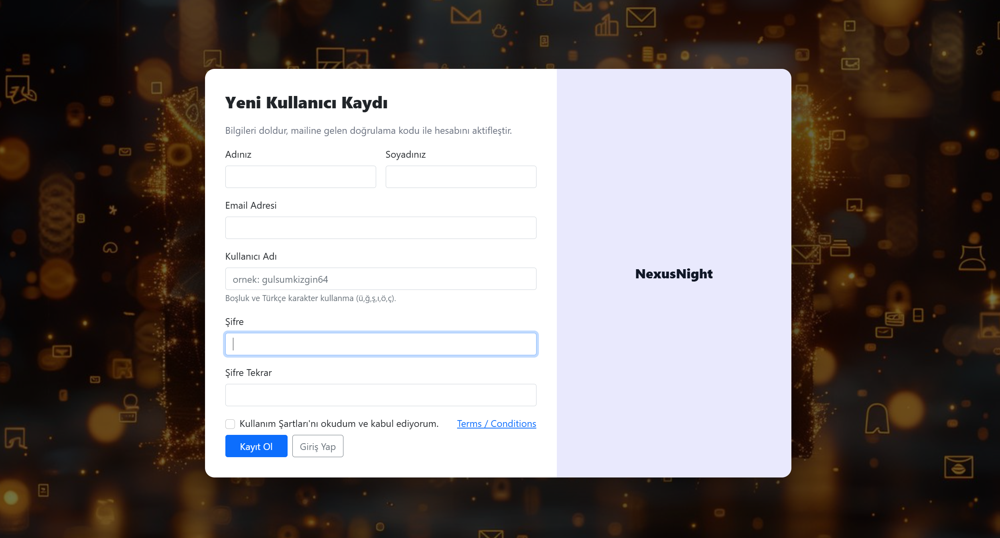

### 📧 Mail Doğrulama
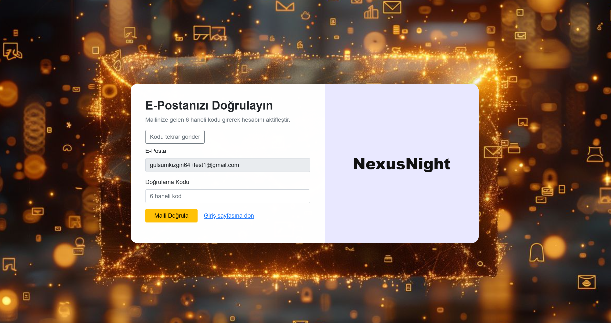

### ✔ Doğrulama Onay
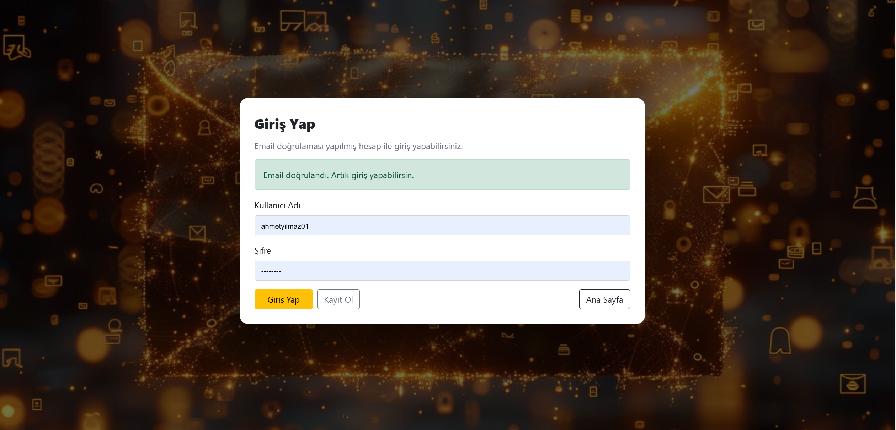

---

### 📊 Kontrol Paneli
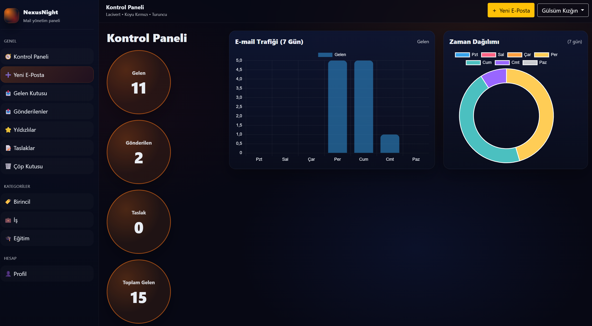

---

### 📥 Gelen Kutusu
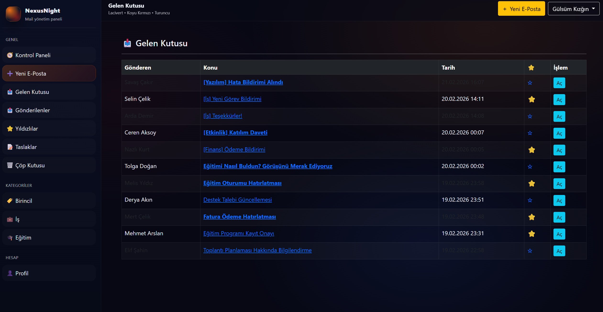

### 📤 Giden Kutusu

---

### ✉ Yeni İleti
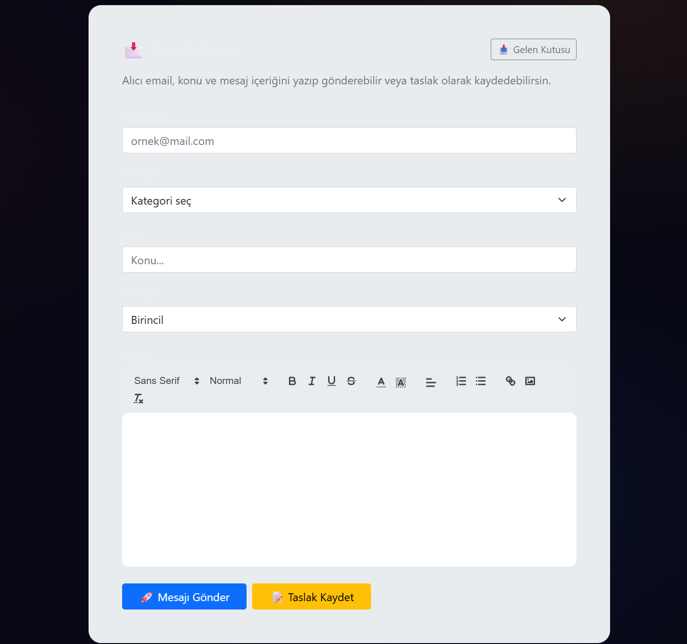

---

### ⭐ Yıldızlı Mesajlar
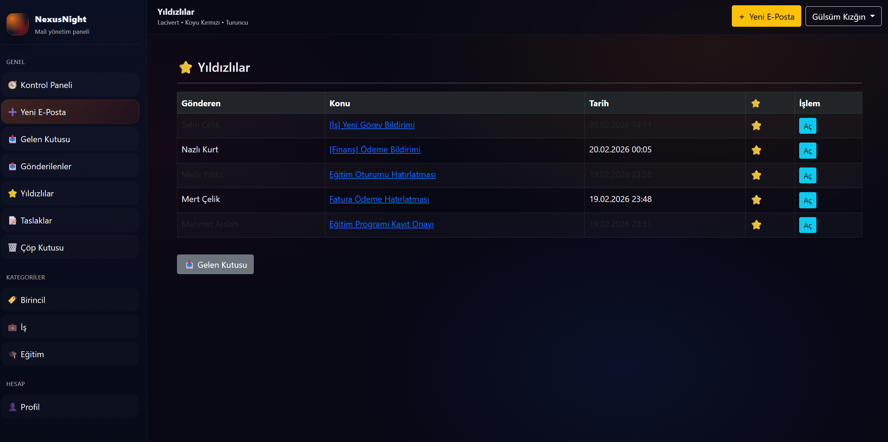

---

### 🗑 Çöp Kutusu
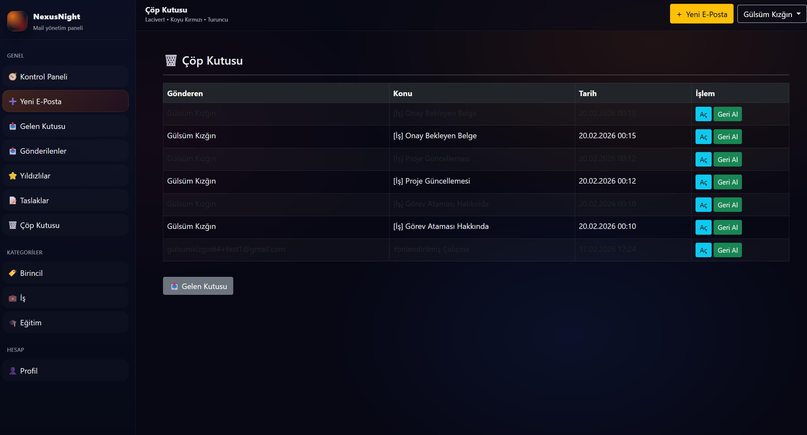

---

### 🏷 Birincil Kategori
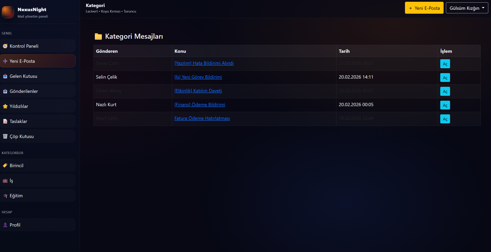

### 💼 İş Kategori
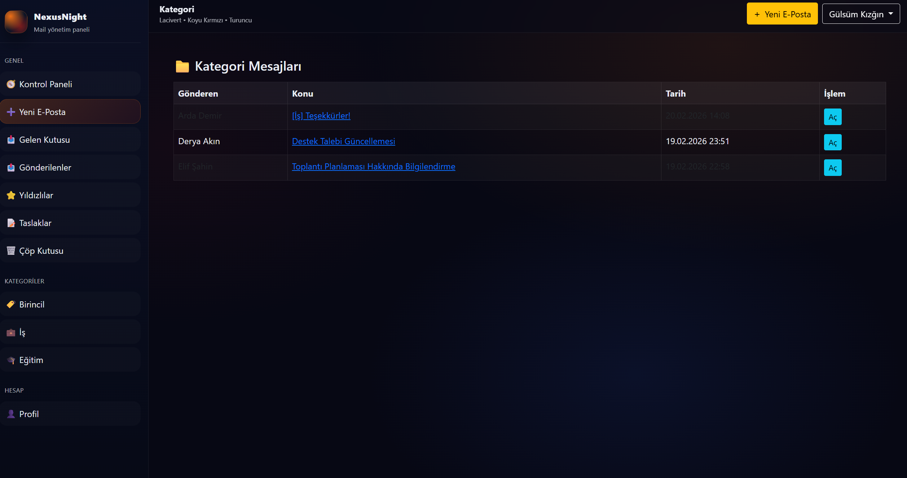

### 🎓 Eğitim Kategori
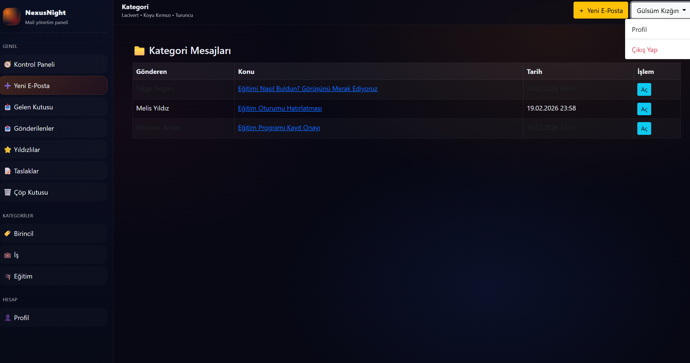

---

### 👤 Profil Sayfası
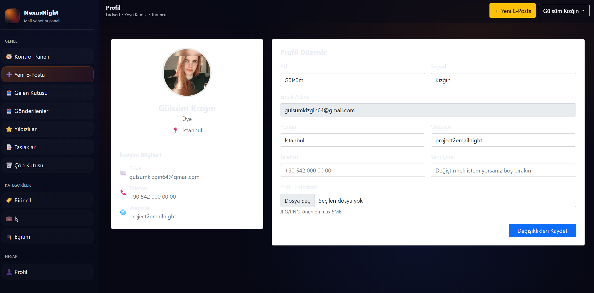